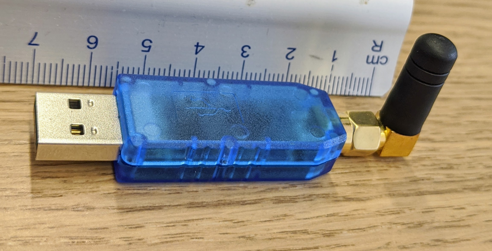
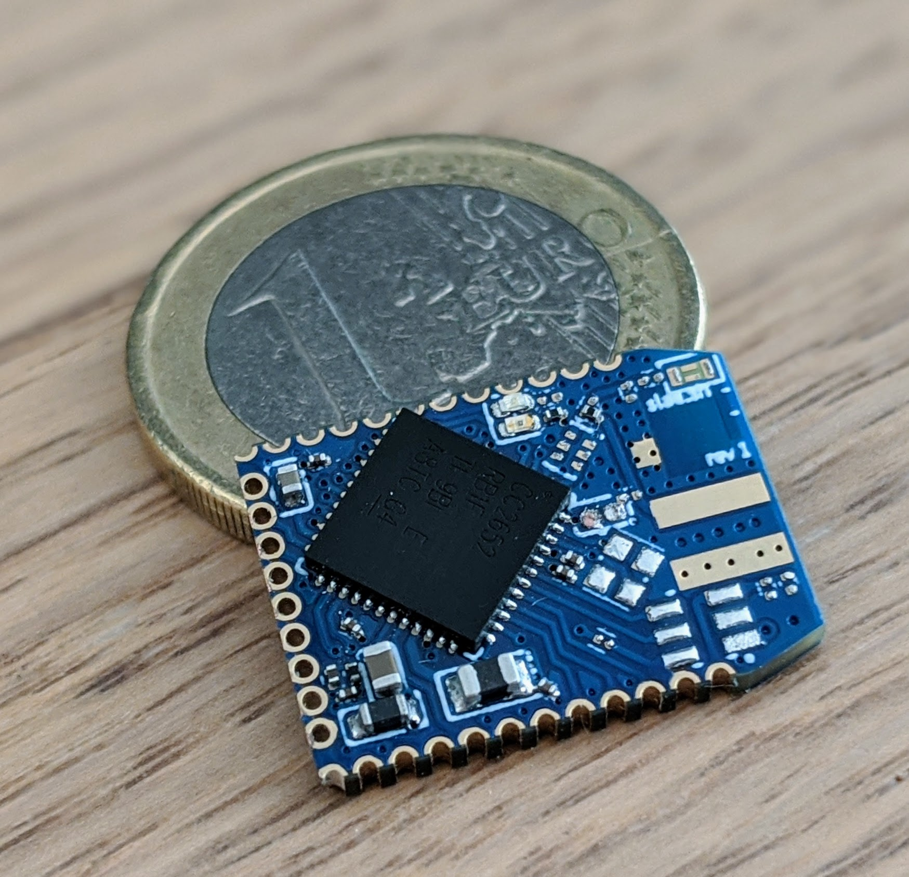
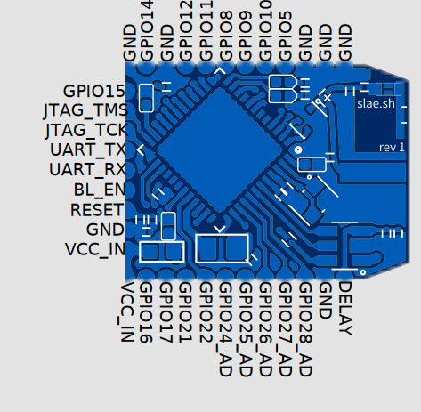
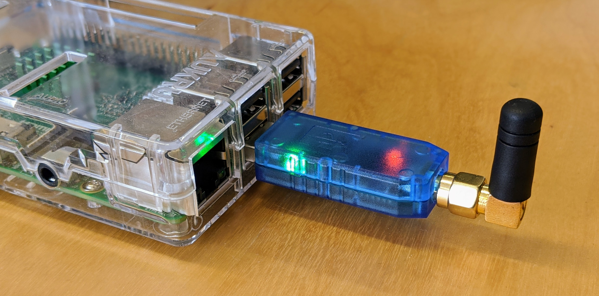
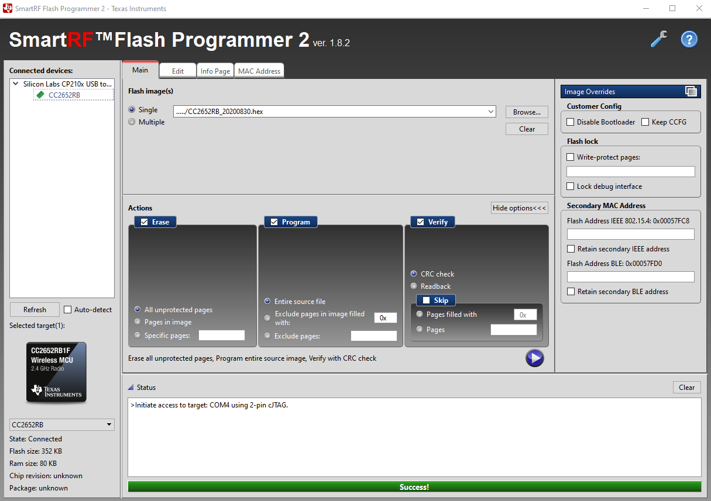
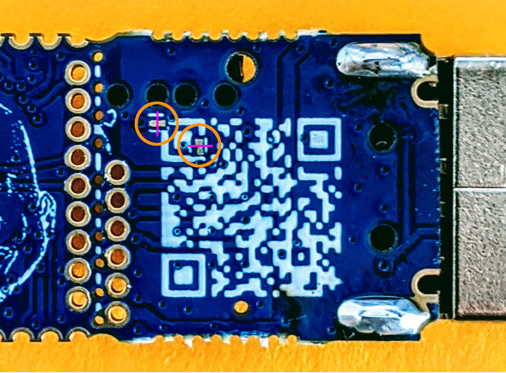

# CC2652RB development stick


!!! tip "what's so cool about it.."
    - super tiny CC2652RB multiprotocol 2.4 GHz development stick<br>
    - Ideal as ZigBee coordinator/router or as an OpenThread border router<br>

## The Stick

### Get one

Pretty easy ;)

https://www.tindie.com/products/slaesh/cc2652-zigbee-coordinator-or-openthread-router/

or just send me a [mail].

Thanks for supporting me!! =)

### Getting started

Unless your ordered it with a specific Firmware, it will be shipped with a stupid blinky Firmware.
This will toggle both LEDs (blue and orange) - it will be only one LED on at a time.

So just plug it into to your PC, RaspberryPi or whatever you want and watch it blinking :D

!!! info
    The PCB will not be shipped within the enclosure, cause it fits very tight and is not that easy to open.
    Needs some patience and good finger feelings! But its possible, for sure.

### Dimensions



Fully assembled with the smallest antenna its around 7cm longs.

The whole stick itself measures around 50x14mm.

The CC2652RB breakout part will be around 18x14mm.

It's smaller than a CR2032 coin cell! And can easily powered by one for multiple years :fontawesome-regular-grin-hearts:



### Pinout

Nearly all free usable pins of the CC2652R are accessable through the pin-headers.



2x12 and 1x9 1.27mm pin-headers

### LEDs

  - Blue: general purpose (GPIO6)
  - Orange: general purpose (GPIO7)
  - Green: power LED (3V3)

### Antenna

It can be shipped in two antenna-options:

  - SMA-connector (female, whole) -> so you can use any SMA (male, pin) antenna!
  - on-chip antenna

## ZigBee coordinator



!!! hint
    Now officially listed on [https://www.zigbee2mqtt.io/information/supported_adapters.html#slaeshs-cc2652rb-stick](https://www.zigbee2mqtt.io/information/supported_adapters.html#slaeshs-cc2652rb-stick)

It's easy to use with the popular [zigbee2mqtt] project from [koenkk]!<br>
Many thanks to him and his awesome work! :fontawesome-regular-grin-hearts: <br>
After getting my fixed costs, we will reward him with every sold ZigBee-stick!

!!! info
    You can just replace your less powerfull CC2531/CC2538 or what ever stick you used before..<br>
    .. with this new powerfull CC2652R device!

!!! warning
    For the images the stick is plugged into the PC/Pi directly to show its dimensions.
    Better DO NOT do it like this, use a USB-Extension cable instead!!<br>
    See further [explanation here].

### Installation

#### Firmware

##### Download

If you already oredered it with the correct firmware, skip this and [continue here](#zigbee2mqtt).

Download the correct FW, using the z-stack firmware 3.x.0:

###### from koenkk

https://github.com/Koenkk/Z-Stack-firmware/tree/master/coordinator/Z-Stack_3.x.0/bin

We will need the CC2652 **RB** file:

https://github.com/Koenkk/Z-Stack-firmware/blob/master/coordinator/Z-Stack_3.x.0/bin/CC2652RB_20200417.zip

Download and extract.

###### from me

This is just for debugging purposes.. Or if you like LED's ;D

Download this firmware file [znp_CC2652RB_20200715.bin](http://slae.sh/downloads/znp_CC2652RB_20200715.bin).

Main difference to koenkk's version:

  - LED's (blue and orange) are turned **ON** at startup.
  - the orange one will blink on each received UART character.

##### Flash

Use this [guide below](/projects/cc2652/#flashing).

#### zigbee2mqtt


Just start it as usual.
See the following documentation: https://www.zigbee2mqtt.io/#getting-started

!!! warning
    We need at least [version 1.14.2](https://github.com/Koenkk/zigbee2mqtt/releases/tag/1.14.2)!

!!! warning
    When migrating from another dongle (e.g. CC2531), make sure to modify your pan_id in your [configuration](https://www.zigbee2mqtt.io/information/configuration.html), otherwise Zigbee2mqtt won’t start.<br>
    If there is no entry `pan_id`, please create one using any other number than `0x1a62`! This is the default one, if there is no one setup.<br>
    You have to re-pair your devices then, cause we created a new network.

#### Homeassistant / Hass.io

There is this super cool hassio add-on from [danielwelch](https://github.com/danielwelch/hassio-zigbee2mqtt)!

Which let's us use the zigbee2mqtt as an easy to use add-on.

[Here](https://smart-home-assistant.de/zigbee2mqtt-installieren/) is a really good installation guide.

!!! warning
    As described above, we need to take care to use at least [version 1.14.2](https://github.com/Koenkk/zigbee2mqtt/releases/tag/1.14.2) of [koenkk]'s [zigbee2mqtt]!


!!! warning
    Another thing we need to take care of, is to use the "long" serial-port names!<br>
    Do ***NOT*** use the syntax like `/dev/ttyUSBx`.<br>
    Instead use the one like `/dev/serial/by-id/usb-Silicon_Labs_slae.sh_cc2652rb_stick_-_slaesh_s_iot_stuff_00_12_4B_00_21_A8_E3_95-if00-port0`!
    <br><br>
    Why should we do this?<br>
    Cause the serial-port using the enumerated-syntax can (and may will) change!<br>
    Using the `/dev/serial/by-id/....` syntax will never change.<br>
    And docker, or the running linux, will find the correct associated serial-port for our device! ;)
    <br><br>
    How can we check the correct name?<br>
    Go to the `Hass.io/Supervisor`-tab, go to `System` and click on the `Hardware`-button.
    <br><br>
    And please do this for all other USB-devices you are using, even in other add-on's. :)

## OpenThread border router


You can also easily use it as a OpenThread border router!<br>
Together with the use of [wpantund] you can control and publish your local OpenThread network.

[wpantund] will connect to the stick flashed with the OpenThread border router FW and will create a local network interface!
this can then easily be used to communicate to OpenThread devices simply by using their IPv6 addresses :fontawesome-regular-grin-hearts:

### Installation

Just flash the following file:

http:// ..

as described [here](/projects/cc2652/#flashing).

## Flashing

There are multiple ways to flash:

  - [JelmerT's serial bootload tool] *recommended*
  - TI's flashing tool [UniFlash] *v6.x.x or higher!*
  - TI's flashing tool SmartRF Flash Programmer2
  - Using a JTAG-Adapter

### Serial bootloader tool

!!! tip "automatic bootloader"
    You dont have to put the CC2652RB manually into the bootloader mode<br>
    Its done by the tool automatically!<br>
    So no need to reopen the enclosure for flashing..

#### Determine com-port

On windows, use this in a Powershell:

```
$comports = Get-WMIObject Win32_SerialPort; $comports | Get-PnpDeviceProperty -InstanceId {$_.pnpdeviceid} -Keyname DEVPKEY_Device_BusReportedDeviceDesc | ForEach-Object { foreach($comport in $comports) { if ($comport.pnpdeviceid -eq $_.instanceid) { new-object psobject -property  @{COMPORT = $comport.deviceid; 'Device-Name' = $_.data} } } }
```

On linux, use this:

```
ls -l /dev/serial/by-id
```

#### flash it

  - Install [python](https://www.python.org/downloads/)
  - Use ```python --version``` to be sure, that you are running python 3 or above!
  - If you are **NOT** running **3.4** or higher, you need to install `pip`, too.
  - Install dependencies with ```pip install pyserial intelhex```
  - Download the [cc2538-bsl.py] file or just clone the repo.<br>
```
git clone https://github.com/JelmerT/cc2538-bsl.git
```
  - Open the directory containing the python-script
  - Open a command line there or just navigate into the folder
  - Type in this command to flash your image to the stick:<br>
```
./cc2538-bsl.py -p “comport” -evw “fw-file”
```

!!! info
    -e will erase the chip<br>
    -w writes the file into flash<br>
    -v will verify the checksum

#### Smart RF Flash Programmer2

To use this tool, we need to put the Chip manually into the Bootloader.

This is done by pressing the buttons in a specific way:

  - Press and hold the bootloader-enable button (nearest to the chip, marked with small "BL")
  - Just press/click the reset-button (nearest to the usb-connector, marked with small "RST")
  - The bootloader-pin can be released.

The Chip will check during the startup the bootloader-enable-pin. If its "set", the bootloader is executed. Otherwise the Application would start!



!!! warning "check disable bootloader checkbox"
    Do NEVER EVER click the Checkbox called "disable bootloader".<br>
    Otherwise we aren't able to flash again!<br>
    Please just take a quick look everytime, that it is NOT checked! ;)


## Development

This stick is a great starting point if you want to get in touch with the 2.4 GHz technologies:

  - ZigBee
  - OpenThread
  - Bluetooth 5 (BLE)
  - any custom RF protocol based on IEEE 802.15.4

You can get ready in just a few minutes and send your first packets through the air!! =)<br>
.. and thats really satisfying ;D

### Enviroment

There is at least one way to programm and debug the CC2652R devices:

  - CCS - Code Composer Studio from TI

You can download the latest version [here].

It shippes with so many example projects! For all possible protocols.

!!! warning "BOOTLOADER SETTINGS"
    TAKE CARE WHILE FLASHING!<br>
    To use the auto-bootloader and flashing via USB you need to take care that the embedded bootloader is enabled and the Backdoor-Pin is routed to GPIO-Pin **13** and ***active low*** !<br>
    Otherwise it's not possible to flash via USB!!    
    
    

My blinky demo can be found [here](https://github.com/slaesh/cc2652-stick/tree/master/example-projects/blinky).

## Trouble shooting

### zigbee2mqtt isn't working

koenkk and i needed to add some code to work properly, cause of the auto bootloader schematic.

So first of all, check which version of zigbee2mqtt you are running currently! See those [hints](#zigbee2mqtt).

If updating is not resolving your issue, please download this [firmware](http://slae.sh/downloads/znp_CC2652RB_20200715.bin) for the stick.

And flash it using the [guide above](/projects/cc2652/#flashing).

This FW is a coordinator, too. But will turn both LED's (blue and orange) **ON** at startup!

The orange one will blink everytime the stick receives any character via UART.

So we can use this for debug purposes:

  - Plug the Stick -> LED's should be both ON!
  - Start zigbee2mqtt
  - If both LED's will turn off during starting zigbee2mqtt we don't have the correct version or some bad settings!
  - Check your `configuration.yaml` to NOT include `rtscts: true` in the `advanced` section.

Still struggling? just get in touch with me: [mail@slae.sh](mailto:mail@slae.sh) !!

### can't get any serial debug messages

Your serial monitor need to release RTS and DTR.

Like on a unix-system, using miniterm:

```
miniterm.py /dev/ttyUSB1 230400 --rts 0 --dtr 0
```

Will open the ttyUSB1 with a baurdrate of 230400.

The RTS signal is connected to the RESET-Pin and DTR is connected to the Bootloader_Enable-Pin!<br>
If you dont wan't this behavior, you can destroy/cut the solder-pads underneath..



## HW files

https://easyeda.com/mxii.monxii/cc2652rb_minimalistic

## Licenses

Hardware License: Solderpad 2.0<br>
Software License: GPL v3<br>
Documentation license: CC BY 4.0<br>

## Contact

Send me an [mail](mailto:mail@slae.sh)

Or text me on [Telegram](https://t.me/slaesh)

[explanation here]: https://www.zigbee2mqtt.io/how_tos/how_to_improve_network_range.html#connect-the-cc2531-using-an-usb-extension-cable
[mail]: mailto:order@slae.sh
[zigbee2mqtt]: https://github.com/Koenkk/zigbee2mqtt
[koenkk]: https://github.com/Koenkk
[JelmerT's serial bootload tool]: https://github.com/JelmerT/cc2538-bsl
[cc2538-bsl.py]: https://github.com/JelmerT/cc2538-bsl/blob/master/cc2538-bsl.py
[here]: https://software-dl.ti.com/ccs/esd/documents/ccs_downloads.html#code-composer-studio-version-10-downloads
[UniFlash]: https://www.ti.com/tool/UNIFLASH
[wpantund]: https://github.com/openthread/wpantund
